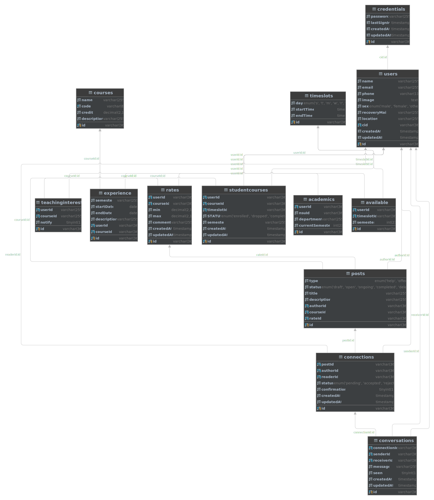

# Pal-Platform
Bootstap Program to proper use of Typescript, ORM (not sequelize). Microservices, Docker, CI/CD, Pipelines and Caching facilites. 

This is not a billion dollar project, but it is a good start to learn how to use the above mentioned technologies so far. But aim of this project to ease of use the technologies I don't know from deep level atleast, Or I used in few projects but not well enough to document it. I will connect all the dots and verify the technologies are working as expected.

## Code base aim 
- [ ] Typescript
- [ ] ORM (not sequelize)
- [ ] Microservices [Auth, Transaction, User, etc]
- [ ] Docker
- [ ] CI/CD [GITHUB ACTIONS/ Jenkins [later]]
- [ ] Linting
- [ ] Coding Standards
- [ ] Testing coverage 100%

**Deadline : 18st December 2022**

## Database Diagram

